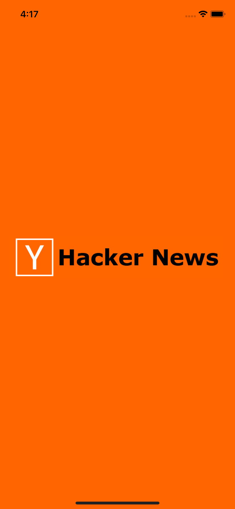
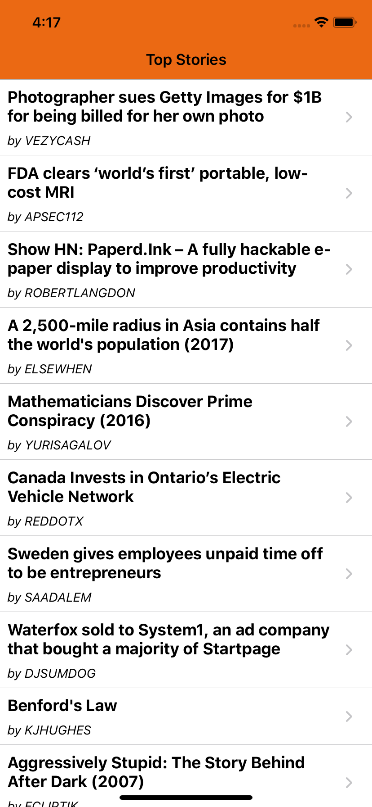

# Hacker News iOS app 
A Hacker News iOS app to fetch top stories.

## Getting Started

1. `$ git clone https://github.com/hanbdi/HackerNewsiOS.git`
2. `$ cd HackerNewsiOS`
3. `$ pod install`     (requires [CocoaPods](https://cocoapods.org))
4. `$ open HackerNewsiOS.xcworkspace`

## Screenshots

## Notes
- Dependency manager: CocoaPods
    - SnapKit: AutoLayout programmatically (I prefer code rather than drag & drop)

- Using git version control
    - Follow git branching standard model
    - Have 2 branches: master & develop (you can check out any branches as both are in synced)

- Development environment:
    - iOS Deployment Target: 10.0
    - Swift language version: Swift 5
    - XCode: 11.1
    
- Project Architecture:
    - Protocol Oriented
    - MVP pattern: Tried to decouple all business logic from ViewController to Presenter classes, so I can manage to write Unit Test for all critical business logic of whole application easily
    - Delegate pattern: To notify changes from Presenter to ViewController (using protocol)

- Unit Test (UT)
    - Due to time constraints, I prefer to focus on test coverage rather than code coverage, so code coverage may not be high due to I yet write UT for any ViewController classes (it easy to get above 80% I believe), all Presenter classes and critical logic is covered with high quality test cases though 
    - Implemented 23 test cases, mostly for Presenter class
        - TopStoriesPresenter: 97.9% coverage
        - StoryService
        - ...

- UI Test
    - Using XCUITest
    - Implemented some test cases so far, focus on appearance and navigation
    
- Features includes
    - Splash screen
    - Top Stories 
        - Fetch all top stories and display on screen
        - Implement lazy loading to load more stories, page size 20 stories for each load more request
        - Pull down to refresh latest top stories
        - For network service, I'm using URLSession to fetch data from firebase endpoint. It's easy to switch to other service library by just conform to StoryServiceProtocol and implement your own network fetching (Firebase client for example)
        - Support self-sizing cells
    - Story Details
        - Using SFSafariViewController to load story url and display on UI as this is no customize required (can use WKWebView also)

## Enhanced
- Lazy load stories to improve performance and data bandwitch
- Using DispatchGroup to make requests concurrent
- Stub for Unit Test so no real network call will hit server during UT and it's ideal isolated for assertion purpose (API contract testing)
- Some stories does not have url returned. To handle this, I decide to show on UI right arrow to indicate it has details if it has valid url, otherwise no arrow will be shown and proper error message will be shown when click on invalid story url.
- Due to story title is too long, I customized table view cell (TopStoriesTableViewCell) to be self-sizing cells so it can show full story title instead of one line trailing if using default UITableViewCell with style .subTitle  
